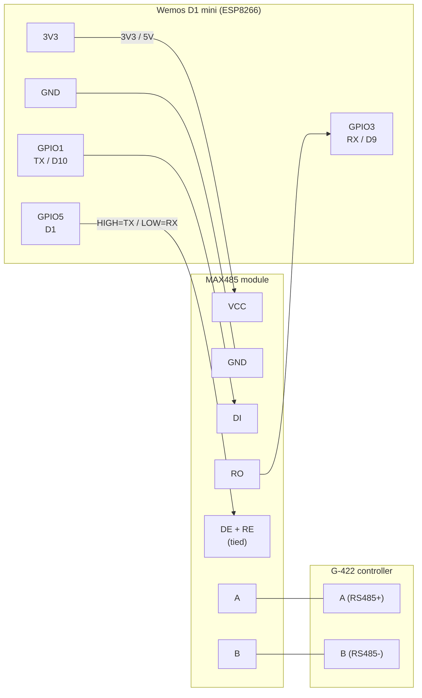

# esphome-hewalex-geco

ESPHome external component for Hewalex / GECO G-422 solar pump controllers
(and, with extension, G-426 heat pump). Talks to the controller over RS485
and exposes registers as native ESPHome sensors — no MQTT broker required.

Port of the Python script in
[hewalex-geco-protocol](https://github.com/...) to a Wemos D1 mini (ESP8266)
+ MAX485 module.

## Hardware

- Wemos D1 mini (ESP8266) — knockoffs work fine
- MAX485 RS485 transceiver module (manual DE/RE, the cheap blue one)
- A few jumpers

### Wiring



| Wemos pin       | MAX485 pin       | Notes |
|---|---|---|
| 3V3 *(or 5V)*   | VCC              | Most MAX485 modules want 5V; check yours |
| GND             | GND              | |
| GPIO1 (TX / D10) | DI              | Wemos transmits → bus |
| GPIO3 (RX / D9)  | RO              | Wemos receives ← bus |
| GPIO5 (D1)       | DE + RE (tied)  | HIGH = TX, LOW = RX |
| —               | A                | → controller A (RS485 +) |
| —               | B                | → controller B (RS485 −) |

`GPIO5` is the default; change it via `flow_control_pin` in YAML.

### Logger note (important)

ESP8266 has only one full-duplex hardware UART (UART0 on GPIO1/3), and we use
that for RS485. The example config moves ESPHome's logger to UART1 — TX-only
on GPIO2 (D4). To watch boot logs over a USB-TTL adapter, hook it to GPIO2.
After first boot you can also use `esphome logs hewalex-zps.yaml` over WiFi/OTA.

## Setup

```sh
git clone <this repo>
cd esphome-hewalex-geco
cp secrets.yaml.example secrets.yaml   # fill in WiFi creds, OTA pwd, API key
pip install esphome                    # or use HA add-on / docker
esphome compile hewalex-zps.yaml
esphome upload hewalex-zps.yaml        # USB the first time, OTA after
esphome logs hewalex-zps.yaml
```

Generate the API encryption key:

```sh
openssl rand -base64 32
```

## Configuration

```yaml
external_components:
  - source:
      type: local
      path: components

uart:
  id: rs485_bus
  tx_pin: GPIO1
  rx_pin: GPIO3
  baud_rate: 38400

hewalex_geco:
  id: hewalex_hub
  uart_id: rs485_bus
  flow_control_pin: GPIO5
  target_address: 2          # default
  source_address: 1          # default
  function_code: 0x40        # default — read registers
  update_interval: 30s
  # register_ranges:         # default = (100,50) (150,50) (200,50)
  #   - start: 100
  #     count: 50

sensor:
  - platform: hewalex_geco
    hewalex_geco_id: hewalex_hub
    name: "Solar T1"
    register: 128
    decode: signed              # or unsigned
    divisor: 1                  # raw / divisor
    unit_of_measurement: "°C"
    device_class: temperature
```

### Register reference (G-422 ZPS)

| Register | Meaning             | Decode    | Divisor |
|---|---|---|---|
| 128–138 (step 2) | Temperatures T1–T6 | signed    | 1 (or 10 if your unit reports tenths) |
| 144     | Solar power         | unsigned  | 1 (W) |
| 150     | Collector pump on   | unsigned  | 1 |
| 152     | Flow                | signed    | 10 (l/min) |
| 166     | Total energy        | unsigned  | 10 (kWh) |

Other registers can be exposed by adding more `sensor:` entries; see
[the protocol notes](https://github.com/...) for what each register means.

## Protocol summary

Wire frame:

```
+--------+--------+--------+--------+--------+--------+--------+--------+------+
| 0x69   | dst    | src    | 0x84   | 0x00   | 0x00   | plen   | crc8   | ...  |
+--------+--------+--------+--------+--------+--------+--------+--------+------+
  hard header (8 bytes, CRC-8/DVB-S2 over bytes 0..6)

soft frame (`plen` bytes):
  dst-lo dst-hi src-lo src-hi fnc 0x80 0x00 count startReg-lo startReg-hi
  ... payload ... crc16-msb crc16-lsb        (CRC-16/CCITT-XMODEM, big-endian)
```

Defaults: `dst=2`, `src=1`, `fnc=0x40` (read), 50 regs per request.

## G-426 heat pump support

Not implemented in v1. The structure has hooks for it:

- `function_code` configurable — heat pump uses different function codes.
- `register_ranges` is a free list — point at heat-pump windows.
- New `decode` types can be added in `sensor/__init__.py` + the C++ enum.

PRs welcome. See `docs/PCWU/` in the upstream repo for protocol notes.

## Verification

After flashing, in the logs you should see:

```
[I][hewalex_geco]: Sent request: start=100 count=50 (expecting 70 bytes)
[D][hewalex_geco]: Response: start=100 data_len=50
[D][sensor:099]: 'Solar T1': Sending state 27.00 °C
...
```

Cross-check values against the original Python script running side-by-side
on the same controller for one cycle to confirm scaling.

## Credit

Protocol reverse-engineering: see
[hewalex-geco-protocol](https://github.com/...) and the elektroda.pl forum
threads referenced therein.
